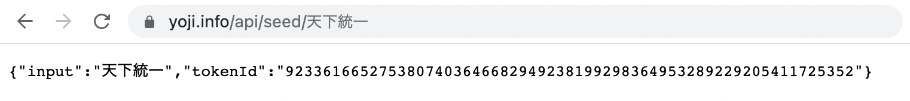
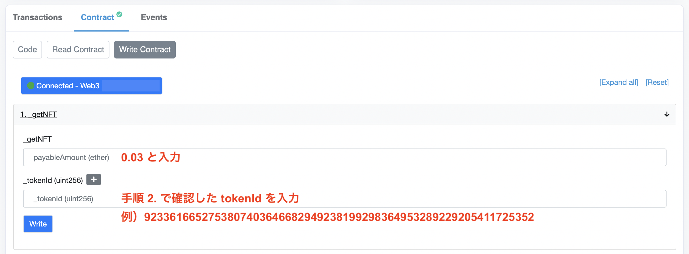
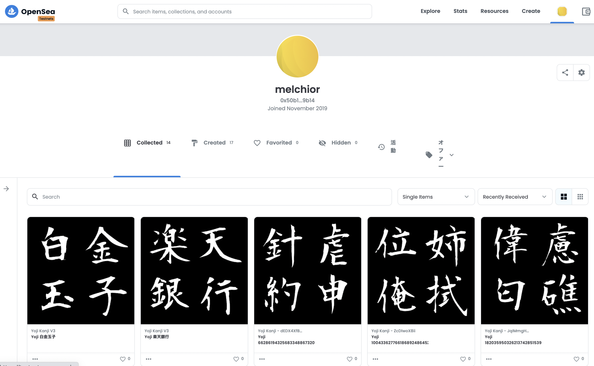

# 四字熟語 NFT [YOJI] 
## 入手方法

1. MetaMask に 0.05 ETH 程度 (NFT 代 0.03 ETH + gas 代 0.02 ETH) を用意します。
2. https://yoji.info/api/seed/四字熟語 にアクセスして tokenId を確認します。

※「四字熟語」の部分を欲しい四字熟語に置き換えてアクセスします。

3. Etherscan (https://etherscan.io/address/{NFT_contract_address}#writeContract) にアクセスします。

4. `1. _getNFT` から NFT を取得します。

5. OpenSea (https://opensea.io/account) から所有している NFT を確認します。

